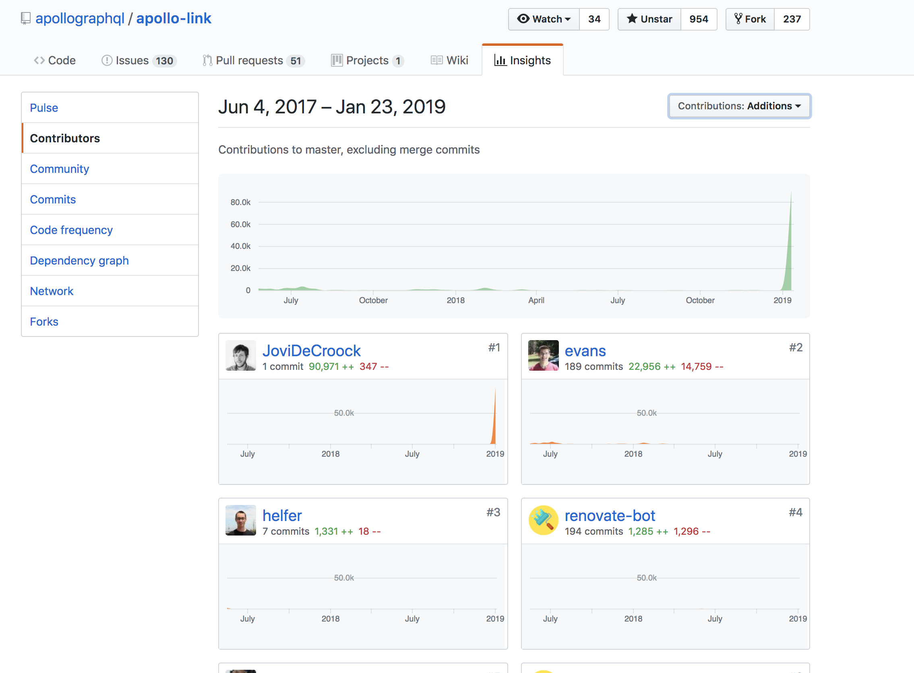

# Introduction

I often use open-source projects, evidently, so I try
to contribute as much as I can to this community.

I can see that making my own libraries isn't always going
to help others, I'll probably keep on doing it but I had
an urge to show more "love" to the popular OSS projects
I was using.

# Getting started

This is a bit more general but if you want to help out in OSS,
please report issues you are havign and if you find the time make
a reproduction. You can't even begin to imagine how much you are
helping out just by doing that.

If you find some documentation unclear and you figure it out yourself,
at that point you are the BEST person to suggest changes to that documentation.
That's why it's good for you to make that clear in an issue or try to do so yourself.

# Apollo

For myself, this repository was the apollo-group. I work with
graphql a lot and I really enjoy how much easier life is when
using apollo.

My first contributions were pretty small, minor bugfixes and feature
requests.

Later this evolved to overhauling the primitive build setup, which
only made a umd build.
I ended up removing the browser field because sites like _unpkg_ don't
need this to know where to find the umd build, made a cjs build for
the main field and a module build for our module field.
This ensured that modern bundlers could tree-shake and thus reducing
the bundle-size.

Recently I've started to "dream" a bit bigger, that's when I
saw an issue on the _apollo-link_ repository about the CI being stuck,
it's worth noting that this is a monorepo of 10+ projects.

Since I didn't have that much experience I started diving into the
_CircleCI_ documentation and trying to optimise this CI process as
much as I could.
The initial issue was more a misconfiguration since forked repo's
weren't triggering builds but still, caching dependencies was happening
in an incorrect and inefficient manner.

The build used to include a seperate step for every library in the monorepo,
in my opinion this was causing some delays. That's why I reduced this all to
one single step named _monorepo_. Which compiles, tests and reports the status
of all subrepo's.

The better caching was done through the package-locks, which gave a funny result
after it was merged since well yes... I lead in additions for the repo now after
one squashed commit.

I hope this post motivates some people to help out in a repo by submitting
an issue with reproduction or whatever they feel like will help out!
